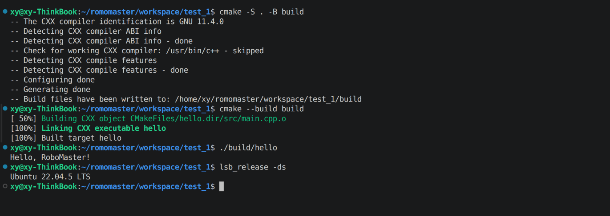

# CMake Hello World

一个最小的 CMake/C++ 示例项目。程序运行后输出：

```text
Hello, RoboMaster!
```

## 环境

- Ubuntu 22.04 LTS
- CMake 3.16 或更高版本
- 支持 C++17 的编译器（已在 GCC 11.4.0 下验证）

## 目录结构

```text
.
├── CMakeLists.txt       # CMake 构建配置，生成 hello 可执行文件
├── README.md            # 环境、构建、运行及验收说明
├── images/
│   └── success.png      # Ubuntu 22.04 构建运行成功截图
└── src/
    └── main.cpp         # Hello, RoboMaster! 程序源码
```

构建产生的 `build/` 目录和本地工具缓存 `.cache/` 已通过 `.gitignore` 排除。

## 构建

在项目根目录执行：

```bash
cmake -S . -B build
cmake --build build
```

## 运行

```bash
./build/hello
```

预期输出：

```text
Hello, RoboMaster!
```

## Ubuntu 22.04 验证

以下截图展示了项目在 Ubuntu 22.04 LTS 上完成配置、构建并成功运行：


